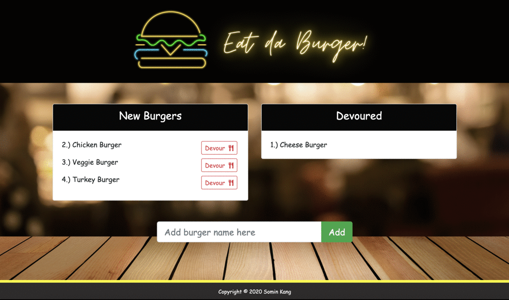

# Eat-Da-Burger
Eat da Burger! is a restaurant app that lets users input the names of burgers they'd like to eat. Whenever a user submits a burger's name, your app will display the burger on the left side of the page. Each burger in the waiting area also has a `Devour it!` button. When the user clicks it, the burger will move to the right side of the page.

## Getting Started
Click <a href="https://lit-refuge-34471.herokuapp.com/">here</a> to start!

## Screen Shots


## Technologies used
- Node.js
- MySQL
- Handlebars - http://handlebarsjs.com/
- body-parser NPM Package - https://www.npmjs.com/package/inquirer
- express NPM Package - https://www.npmjs.com/package/express
- mysql NPM Package - https://www.npmjs.com/package/mysql
- handlebars NPM Package - https://www.npmjs.com/package/handlebars
- express-handlbars NPM Package - https://www.npmjs.com/package/express-handlebars

## Installation
1. Clone the Git repository

   ```
   $ git clone <repo>
   ```
2. Navigate to the directory and install the dependencies 
   ```
   $ npm install
   ```

## Using the Application Locally
1. Create a MySQL database and run the following files to set up the schema
    * db/schema.sql
    * db/seeds.sql
2. Configure the database connection settings in config/connection.js
3. Navigate to the repository folder and run server.js to start

   ```
   $ node server.js
   ```

4. Navigate to localhost:3000 in the browser

5. Add burgers to the New Burgers List and eat them!

